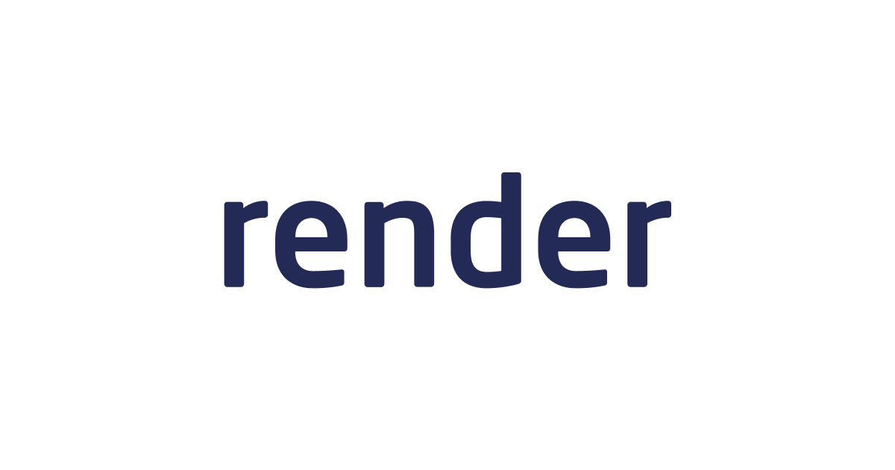

# MERN Stack Admin Dashboard

This project is a comprehensive full-stack admin dashboard application built
using the MERN stack, with a focus on modern web development practices and
tools. This walkthrough will go over the technologies used, and the features of
the application.

## Live Demo

- **Frontend**:
  [View Live Frontend](https://world-economy-frontend.onrender.com)
- **Backend**: [View Live Backend](https://world-economy.onrender.com)

## Features

- **Responsive Design**: The dashboard is designed to be responsive, providing
  an optimal viewing experience across various devices.
- **State Management**: Efficient state management using Redux Toolkit Query
  ensures smooth data flow and interaction within the app.
- **Data Visualization**: Integration with Nivo Charts allows for dynamic and
  interactive data visualizations.
- **Authentication**: User authentication is implemented to secure the admin
  panel.
- **Real-Time Data Updates**: The dashboard supports real-time data updates,
  enhancing user experience.

## Technologies Used

    
    

### Frontend

- [React.js](https://react.dev/): A powerful JavaScript library for building
  user interfaces. React's component-based architecture allows for efficient and
  scalable development.
- [Redux Toolkit](https://redux-toolkit.js.org/): A toolset for efficient data
  fetching and caching, simplifying state management and API interactions.
- [Material UI (MUI)](https://mui.com/material-ui/): A popular React UI
  framework that provides a set of reusable components for building
  aesthetically pleasing and responsive user interfaces.
- [Nivo Charts](https://nivo.rocks/): A library for creating rich and
  interactive data visualizations in React.

### Backend

    
    

- [Node.js](https://nodejs.org/en): A JavaScript runtime that allows for
  building scalable network applications. Node.js is used to run the backend
  server.
- [Express.js](https://expressjs.com/): A web application framework for Node.js
  that simplifies the process of building robust APIs.
- [MongoDB](https://www.mongodb.com/): A NoSQL database known for its
  flexibility and scalability, used for data storage and retrieval.

### Deployment

    
    

- [Render](https://render.com/): A unified cloud to build and run all your apps
  and websites with free SSL, a global CDN, private networks and auto deploys
  from Git. Both the frontend and backend of this application are deployed on
  Render.com.
- [GitHub](https://github.com/): Used for continuous integration and deployment
  (CI/CD), ensuring that changes are automatically tested and deployed.

## License

This project is licensed under the MIT License. See the [LICENSE](LICENSE) file
for details.
